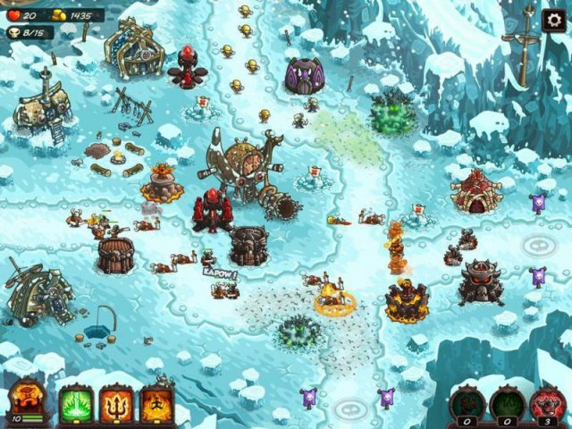
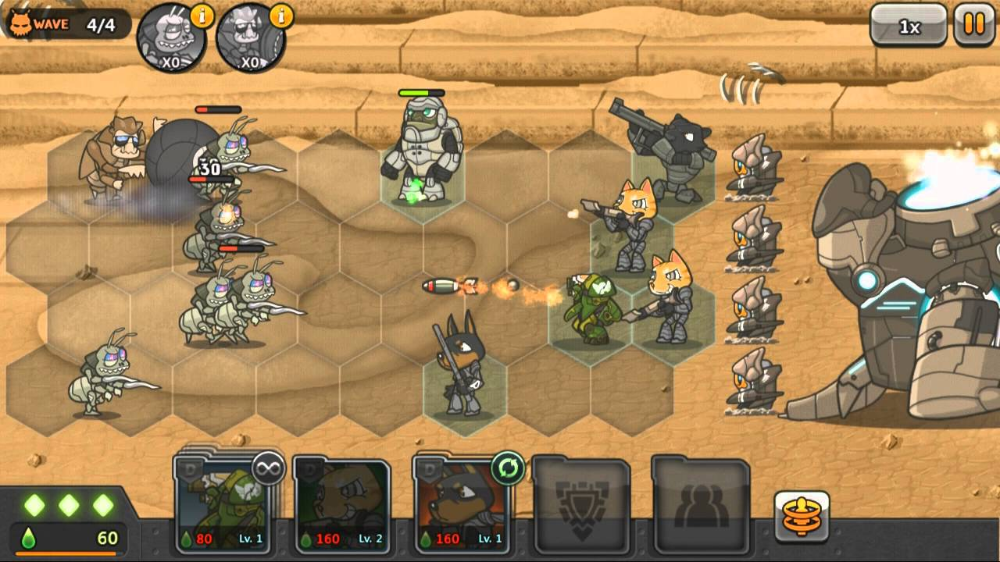
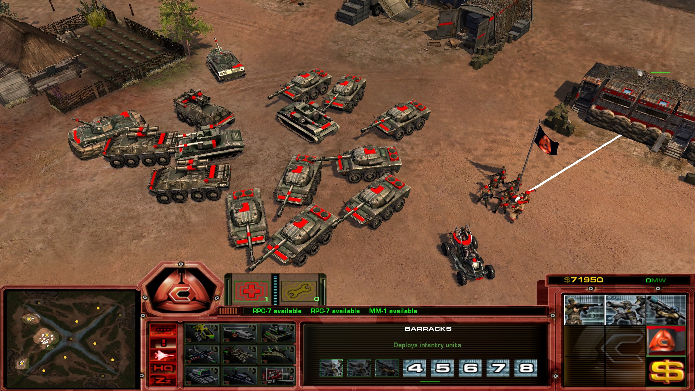

[컨셉](#컨셉)  
[게임 시스템 디자인](#게임-시스템-디자인)  

# 게임명 : 우주방어  

여러 타게임에서도 무조건적으로, 막무가내로 거대한 규모의 방어를 해낼 때 '우주방어'를 한다고 표현함. 공교롭게도 우주 기지 방어가 이 게임의
컨셉이기도 하기에 이렇게 게임명을 설정하게 됬음 

# 1. 컨셉  

## 메인컨셉  
### 디펜스
몰려오는 적을 막아야함
### 서브 컨셉 1
균형 : 방어와 증강을 균형있게 해야함, 한쪽으로 치우칠 경우 언젠가 뚫림
### 서브 컨셉 2
상성 : 유닛에 따라 막을 수 있는 적과 그러지 않은 적들이 존재함
### 서브 컨셉 3
유닛(AI) : 내가 생산한 유닛이 조작에 따라 명령을 듣고 주변 적을 감지하여 공격하게 함
### 서브 컨셉 4
지형 : 지형 활용도에 따라 방어를 용이하게함
### 서브 컨셉 5
물량 : 점점 늘어나는 적의 수에 따라 플레이어도 더 많은 유닛을 통솔해야함  

## 관련이미지

자원UI, 지형

단계, 유닛생산UI
  

## 대표이미지  
  

## 컨셉 and 대표이미지 기반 작품묘사

메인 컨셉은 디펜스로서 계속 몰려오는 적을 막아내는 게임임

대표이미지와 같이 좌측 상단에 웨이브(단계), 우측 상단에 점수를 기재
나머지 편의 장치들은 우측 하단에 배치 예정임
유닛을 마우스로 이동 시킬 수 있음
생산 관련 인터페이스는 하단에 배치
좌측 이미지처럼 자원 현황은 왼쪽 상단에 배치

## 우주방어 구성요소  

### 제작 툴
Unity를 통해 제작
### 도전과제
점점 많이 몰려오는 적을 막아야한다. 사령부가 파괴되면 안된다.
### 재미요소
적이 점점 강해지고 막아야 할 곳이 많아져 긴박함을 느끼게 해 줌
자원을 활용하여 상황에 알맞는 유닛을 뽑아 강해지는 유닛에 대처할 수 있음
내 실수로 뚫리게 되면 다시 해보겠다는 도전심을 유발함
### 참신함
다른 디펜스 게임 요소와는 다르게 방어 요소를 이동 할 수 있음
### 카메라 관점
넓은 3인칭 시야를 통해 전장을 총괄 할 수 있게 했음
### 미적요소
캐주얼한 느낌으로 보는 데에 부담이 없음. 여러 도형을 이어 붙여 	유닛을 만들 것임

## 게임의 흐름
디펜스 게임답게 쉬운 웨이브부터 시작함
대표 이미지에서는 길이 여러 개이지만 처음에는 한 개만 열려있음. 웨이브가 높아질 수록 길이 여러 개가 됨
웨이브 시작 전마다 자원이 지급됨. 자원을 활용하는 것은 사용자의 몫. 하지만 미래를 위해 선택의 고민을 해야 함.
웨이브가 올라갈 수록 더 많은, 강한 적들이 생성됨에 따라 까다로움을 느낄 것임
유닛을 이동 시켜서 방어선이 뚫리는 곳을 보충 할 수 있음. 유닛의 상성에 따른 이동 유닛의 종류나 양을 생각해봐야 함

# 게임 시스템 디자인

## a. 게임 오브젝트 분해

|연번|오브젝트 이름|오브젝트 이미지|
|------|---|---|
|1|해병||
|2|탱크||
|3|광견||
|4|베히모스||
|5|사령부||

### b. 파라미터(속성) 뽑아보기
1) 오브젝트 이름 : 해병

|속성|해당 수치|설명|비고|
|------|---|---|---|
|공격력|10|표준 공격력|-|
|체력|100|0이 되면 죽음|-|
|방어력|0|공격력에서 차감해서 체력이 닮|-|
|사정거리|30m/s|-|-|
|이동속도|5m/s|-|-|

2) 오브젝트 이름 : 탱크

|속성|해당 수치|설명|비고|
|------|---|---|---|
|공격력|100|표준 공격력|-|
|체력|1000|0이 되면 죽음|-|
|방어력|5|공격력에서 차감해서 체력이 닮|-|
|사정거리|60m/s|-|-|
|이동속도|10m/s|-|-|

3) 오브젝트 이름 : 광견

|속성|해당 수치|설명|비고|
|------|---|---|---|
|공격력|5|표준 공격력|-|
|체력|70|0이 되면 죽음|-|
|방어력|1|공격력에서 차감해서 체력이 닮|-|
|사정거리|근접|-|-|
|이동속도|12m/s|-|-|

4) 오브젝트 이름 : 베히모스

|속성|해당 수치|설명|비고|
|------|---|---|---|
|공격력|80|표준 공격력|-|
|체력|1000|0이 되면 죽음|-|
|방어력|5|공격력에서 차감해서 체력이 닮|-|
|사정거리|근접|-|-|
|이동속도|6m/s|-|-|

5) 오브젝트 이름 : 사령부

|속성|해당 수치|설명|비고|
|------|---|---|---|
|공격력|20|표준 공격력|-|
|체력|10000|0이 되면 죽음|-|
|방어력|0|공격력에서 차감해서 체력이 닮|-|
|사정거리|30m/s|-|-|
|이동속도|-|-|-|

### c. 행동

1) 오브젝트 : 유닛

|행동|설명|
|---|---|
|이동|마우스 우클릭으로 지정한 위치로 이동|
|공격|사거리 내에 있는 적에게 공격 또는 공격하러 이동|

2) 오브젝트 : 건물(ex. 사령부)

|행동|설명|
|---|---|
|공격|사거리 내에 있는 적에게 공격|
|알림|사령부의 경우 공격 받고 있다고 소리로 알림을 줌|
|수리|돈을 지불하고 체력을 회복 함|

### d. 상태

1) 오브젝트 : 유닛

|현상태|전이상태|전이조건|
|------|---|---|
|보통|-|-|
|빈약|체력바가 빨간색으로 됨|체력이 30% 미만|

2) 오브젝트 : 건물

|현상태|전이상태|전이조건|
|------|---|---|
|보통|-|-|
|화재|체력바가 빨간색으로 되고 체력이 서서히 닮|체력이 30% 미만|

### e. 플레이어 캐릭터 속성(파라미터)

|속성|영문명칭|설명|비고|
|------|---|---|---|
|공격력|Attack power|공격시 체력을 깎는 수치|-|
|체력|HP|HP가 0이 되면 사망함|-|
|방어력|Defence power|공격 당했을시 방어력 수치를 뺀 수가 체력에 영향|-|
|사거리|Range|공격 할 수 있는 사정거리|-|
|이동속도|Speed|이동하는 속도, 건물의 경우 0|-|

### f. 게임의 규칙

1) 핵심 규칙
 몰려오는 유닛을 막아 사령부를 지켜야한다. 사령부가 무너질 경우 패배.  
 메뉴에서 난이도를 선택해서 웨이브 수가 지정됨. 지정된 웨이브까지 막을 경우 승리로 끝남.
 
### g. 게임에서 사용될 공식

1. 유닛 전투  
(1) 유닛 A의 AttackPower로 유닛 B의 HP를 깎는다.  
(2) DefencePower 값이 0보다 크면 깎이는 Hp는 AttackPower - DefencePower의 수치가 된다.  
(3) A또는 B의 HP가 0이 될 때까지 반복하고 0이 된 유닛은 죽는다(사라진다).  
(4) 이후 살아있는 유닛은 주변에 있는 적 유닛을 감지해 이를 반복한다.  

2. 유닛 이동  
(1) 한 유닛을 좌클릭 또는 드래그 범위 안에 있는 아군 유닛을 선택한다.  
(2) 우클릭을 통해 위치 값을 받아 해당 위치로 움직이게 한다.  
(3) 이동 중에 적 유닛이 사거리에 들어오면 유닛 전투를 한다.  
(4) 전투가 끝난 후에 지정한 위치로 계속 이동한다.  

## 개발 요구사항 & 흐름도

### a. 요구사항(1년)  
(1)시작화면, 점수화면, 게임화면 총 3개의 화면이 있다.  
(2)시작화면에서는 게임 시작 버튼과 간단하게 게임 방법을 설명해주는버튼이 있다.  
(3)게임 방법 버튼을 누르면 조작 방법을 보여준다.  
(4)게임 시작 버튼을 누르면 게임을 바로 시작한다.  
(5)게임화면에서는 좌측 상단에 단계(Wave)가 표시되고 우측 상단에 점수(Score)가 표시 된다. 하단에 생성 할 수 있는 건물 및 유닛 패널이 있다.  
(6)유닛 생성은 패널에서 생성 위치로 드래그 앤 드롭을 이용한다.  
(7)유닛과 건물 선택은 마우스 좌클릭, 이동과 공격은 마우스 우클릭을 이용한다.  
(8)유닛들은 사정거리 안에 적을 감지하여 공격한다.  
(9)건물과 유닛이 배치 되어있는 길은 3갈래 길이다. 중간에 샛길 하나가 있는데 처음에는 잔해로 막혀있지만 4단계부터 적들이 그곳에 나타나 잔해를 부수고 들어온다.  
(10)단계가 증가 할 수록 유닛 수가 점점 증가하고 단계 수는 15단계이다.  
(11)게임 종료 조건은 사령부가 깨지면 패배하거나 모든 단계를 막았을 때 승리로 끝난다.  
(12)게임 종료시 막아낸 단계 수가 화면 중앙에 표시된다.  
(13)게임 종료 후 화면에서 우측 상단에 메인 메뉴로 돌아가기 버튼을 눌러 돌아가거나 사용자 조작이 없을 경우 15초 후에 자동으로 메뉴로 보낸다.
(14)유닛 전투시 타격 효과음과 상황에 맞는 시각적 효과를 넣는다.
(15)유닛들의 부위 별로 행동과 상태에 따라 적절한 애니메이션을 부여한다.
(16)생산한 유닛이나 사용한 자원 양이 3초 동안 표시 되도록 나타내는 효과를 부여한다.

### a. 요구사항(6주)  
(1)시작화면, 점수화면, 게임화면 총 3개의 화면이 있다.   
(2)게임 시작 버튼을 누르면 게임을 바로 시작한다.  
(3)게임화면에서는 좌측 상단에 단계(Wave)가 표시되고 우측 상단에 점수(Score)가 표시 된다. 하단에 생성 할 수 있는 건물 및 유닛 패널이 있다.  
(4)유닛 생성은 패널에서 생성 위치로 드래그 앤 드롭을 이용한다.  
(5)유닛과 건물 선택은 마우스 좌클릭, 이동과 공격은 마우스 우클릭을 이용한다.  
(6)유닛들은 사정거리 안에 적을 감지하여 공격한다.  
(7)단계가 증가 할 수록 유닛 수가 점점 증가하고 3단계까지 프로토타입으로 만들어 새로운 유닛과 추가 유닛이 생성 되도록 한다.
(8)게임 종료 조건은 사령부가 깨지면 패배하거나 모든 단계를 막았을 때 승리로 끝난다.  
(9)게임 종료 후 화면에서 우측 상단에 메인 메뉴로 돌아가기 버튼을 눌러 돌아가거나 사용자 조작이 없을 경우 15초 후에 자동으로 메뉴로 보낸

## 키보드 이벤트 흐름도  

## 용어 정리  

|No|화면||용어|설명|
|------|---|---|---|---|
|1|시작 화면|화면 요소|게임 시작|클릭 시 게임이 시작되고 게임 화면으로 이동한다.|
|2|시작화면|화면 요소|게임 방법|게임 조작에 관련된 설명 화면이 나타난다.|
|3|게임 화면|화면 요소|단계(Wave)|현재까지의 단계(Wave)를 나타낸다.|
|4|게임 화면|화면 요소|점수(Score)|현재까지 처치한 적의 수에 따른 점수를 나타낸다.|
|5|게임 화면|화면 요소|생성 패널(Panel)|마우스 드래그 앤 드롭을 통해 유닛 생성을 할 수 있는 패널이다.|
|6|게임 화면|화면 요소|사령부|파괴될시 게임이 패배로 끝나는 건물이다.|
|7|게임 화면|화면 요소|길|적들이 오는 경로로 여러 갈래의 길이 있다.|
|8|게임 화면|화면 요소|유닛|생성 패널로 만들거나 자동 생성 되는 적들을 일컫는다.|
|9|게임 화면|스크립트 요소|MouseLClick|마우스 좌클릭으로 유닛 선택 기능이 있다.|
|10|게임 화면|스크립트 요소|MouseRClick|마우스 우클릭으로 위치 이동 기능이 있다.|
|11|게임 화면|스크립트 요소|AttackPower|유닛 및 건물의 공격력을 나타낸다.|
|12|게임 화면|스크립트 요소|Defence|유닛 및 건물의 방어력을 나타낸다.|
|13|게임 화면|스크립트 요소|Hp|유닛 및 건물의 체력. 수치상으로 나타낸다.|
|14|게임 화면|스크립트 요소|Range|공격 가능한 유닛 및 건물의 공격 사정거리를 나타낸다.|
|15|게임 화면|스크립트 요소|Speed|유닛의 이동 속도. 수치상으로 나타낸다.|
|16|게임 화면|스크립트 요소|MoveSD|유닛이 이동시에 나는 효과음을 나타낸다.|
|17|게임 화면|스크립트 요소|BattleSD|유닛이 전투시에 나는 효과음을 나타낸다.|

## 개발 작업 일정 (6주)  

1주차 : 모든 UI 화면 요소 디자인, 모든 버튼 기능 구현  

2주차 : 건물 및 유닛 등 구성요소, 지형 디자인 및 구현  

(1, 2주차 작업은 빠른 시일 내로 끝내고 3주차로 작업으로 가는 것을 목표로 하고 있음)  

3주차 : 아군 유닛과 적 유닛의 생성, 모든 유닛의 이동 구현

4주차 : 유닛들의 전투 구현

(3, 4주차 구현 작업이 주가 될 것임)

5주차 : 단계에 따른 유닛 생성과 게임의 마무리 기능을 구현

6주차 : 점검 및 미비 요소 고치기
